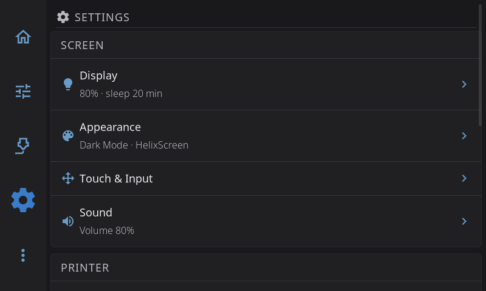
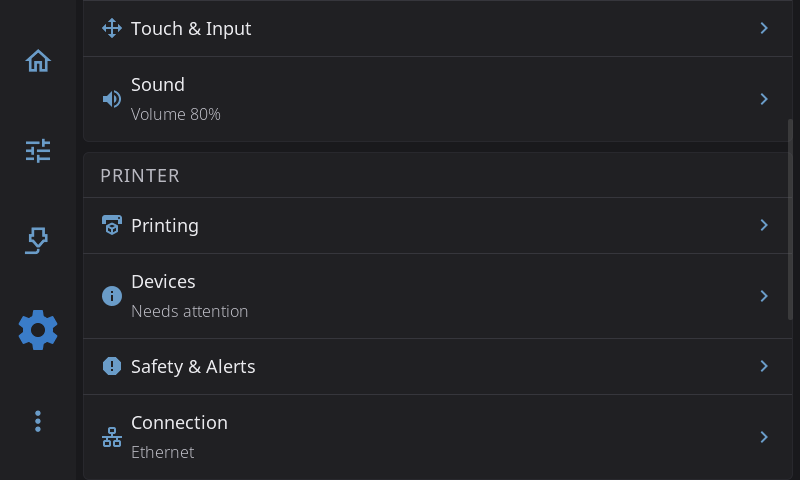
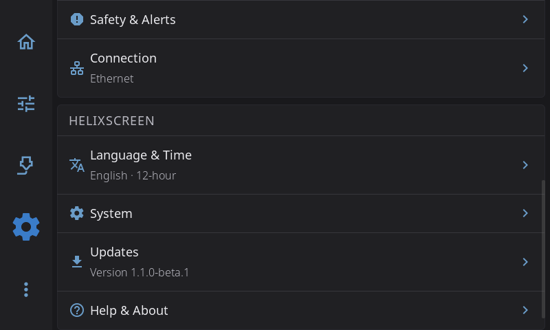

# Settings

Tap the **gear icon** in the navigation bar to open Settings. It's a single list of pages in three groups, and every page is one tap away.

## The three groups

**Screen** is about the touchscreen you're holding: how it looks, how it reacts to your finger, and how it sounds.

| Page | What's in it |
|------|--------------|
| [Display](settings/display.md) | Screen rotation, UI scale, brightness, screen dim, display sleep, screensaver, sleep while printing |
| [Appearance](settings/appearance.md) | Dark mode, color themes and the theme editor, animations, widget labels, and how the printer is drawn (toolhead picture, G-code preview, Z labels, bed mesh view) |
| [Touch & Input](settings/touch-input.md) | Touch calibration, touch points, scroll and long-press feel, home screen editing, scroll buttons, and on Android the keyboard and navigation bar |
| [Sound](settings/sound.md) | Sounds on or off, volume, button sounds, sound theme, output device, sound preview. Only shown when HelixScreen finds a speaker or buzzer |

**Printer** is about the printer the screen drives and the hardware around it.

| Page | What's in it |
|------|--------------|
| [Printing](settings/printing.md) | Machine limits, motion, retraction, enclosure, material temperatures, cold load and unload, cooling the nozzle after a filament change, timelapse, macro buttons |
| [Devices](settings/devices.md) | Hardware health, camera, filament system, fans, sensors, [LED settings](settings/led-settings.md), power devices, Spoolman (with label printer and barcode scanner) |
| [Safety & Alerts](settings/safety.md) | E-Stop confirmation, cancel escalation, macro confirmation, spaghetti detection, print completion alert, on-screen alerts |
| [Connection](settings/connection.md) | Wi-Fi and Ethernet, your printers, the Moonraker address |

**HelixScreen** is about the app itself.

| Page | What's in it |
|------|--------------|
| [Language & Time](settings/language-time.md) | Language, timezone, 12 or 24-hour clock |
| [System](settings/system.md) | Screen lock PIN, performance, usage data, log level, restart, factory reset |
| [Updates](settings/updates.md) | Update channel, checking for and installing updates. Shows a note instead when your firmware handles updates |
| [Help & About](settings/help-about.md) | Welcome tour, debug bundles, Discord, documentation, and About (versions, system details, print hours) |

## Status lines

Some rows show a short line under their name, so you can check things without opening the page. The lines refresh every time you come back to the Settings screen.

| Row | What the line shows | Examples |
|-----|---------------------|----------|
| **Display** | Brightness and when the screen sleeps | *80% · sleep 10 min*, *80% · never sleeps*, *Sleep 10 min* (screens without brightness control) |
| **Appearance** | Light or dark, and your theme | *Dark Mode · Nord* |
| **Sound** | Your volume | *Volume 60%*, *Muted* |
| **Devices** | A hardware health check | *All healthy*, *Needs attention*, *Problem found* |
| **Connection** | How the screen is connected | *Wi-Fi HomeNet*, *Ethernet*, *Not connected* |
| **Language & Time** | Your language and clock | *English · 24-hour* |
| **Updates** | Whether an update is waiting | *Up to date*, *1.1.1 available*, *Checking…*, *Check failed*, *Version 1.1.0*, *Managed by firmware* |

Touch & Input, Printing, Safety & Alerts, System and Help & About have no status line.

## Where did it go?

If you're coming from HelixScreen 1.0, Settings used to have six categories. Everything is still there and keeps its value; this is where each part moved.

| In 1.0 | Now |
|--------|-----|
| Display & Sound: brightness, dim, sleep, screensaver, rotation, UI scale | [Display](settings/display.md) |
| Display & Sound: dark mode, theme colors, animations, widget labels, bed mesh render | [Appearance](settings/appearance.md) |
| Display & Sound: sounds, volume, sound theme | [Sound](settings/sound.md) |
| Display & Sound: language, timezone, time format | [Language & Time](settings/language-time.md) |
| Display & Sound: scroll buttons, system keyboard, keep navigation bar | [Touch & Input](settings/touch-input.md) |
| Printing: toolhead style, G-code preview, Z movement | [Appearance > Printer Visuals](settings/appearance.md#printer-visuals) |
| Hardware & Devices | [Devices](settings/devices.md) |
| Hardware & Devices > Printers | [Connection > Printers](settings/connection.md#printers) |
| Safety & Notifications | [Safety & Alerts](settings/safety.md) |
| Safety & Notifications: allow cold load/unload, cool nozzle after filament ops | [Printing](settings/printing.md#allow-cold-loadunload) |
| System > Network Settings, System > Host | [Connection](settings/connection.md) |
| System > Touch & Input | [Touch & Input](settings/touch-input.md), now straight from the Settings screen |
| Help & About > About: update channel, check for updates | [Updates](settings/updates.md) |

---

**Next:** [Advanced Features](advanced.md) | **Prev:** [Calibration & Tuning](calibration.md) | [Back to User Guide](../USER_GUIDE.md)
